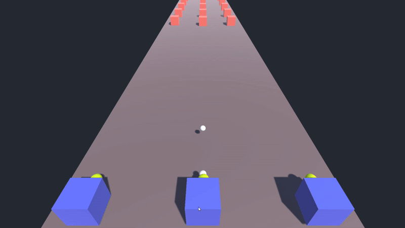

# HYBRID ECS - Unity

A complete Endless shooter 3D Hybrid ECS unity project.

Although Hybrid ECS doesn't provide a highly performant code, but works just fine to understand and play around with this new way of writing more structured, reusable code.

Currently, the project has these set of systems:
- Input System
- Collision Event System
- Movement System
- Firing System
- Enemy Spawn System 

Feel free to drop in a comment when you see a place for improvement.

